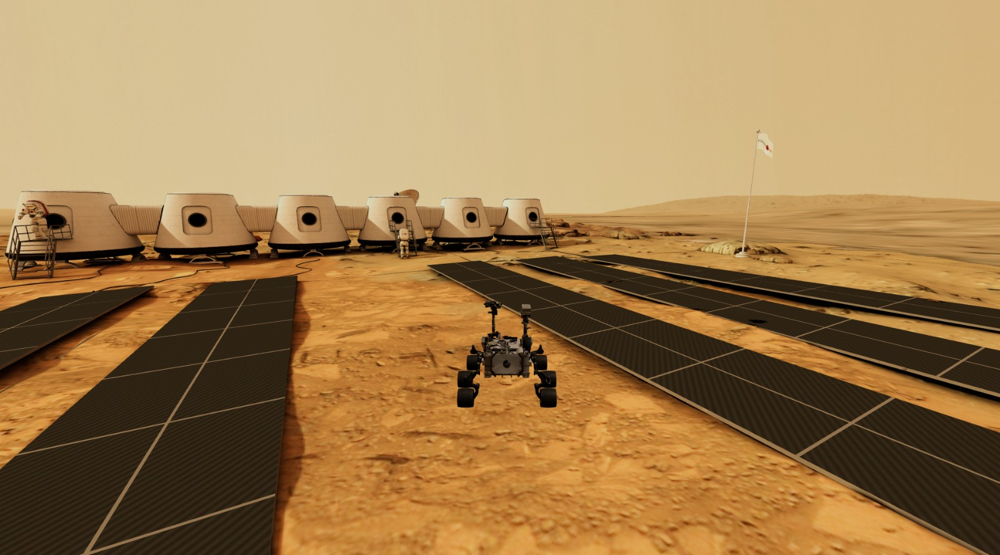

# MARS ROVER — Exploração Planetária de Marte 3D




---
# Link do Vídeo

#### YouTube: https://youtu.be/LEfDNSb5Iu8
---
# Descrição Geral do Projeto

Este projeto foi desenvolvido como trabalho prático da disciplina de **Computação Gráfica**, com o objetivo de criar uma aplicação gráfica interativa em **Three.js** que simule um **ambiente de exploração planetária 3D**.  

O trabalho segue todas as orientações previstas pelo professor Gabriel Marcelino Alves, integrando **iluminação realista**, **texturas detalhadas**, **modelos 3D importados**, **navegação interativa** e **design criativo com temática definida**.

---

# Conceito do Projeto

A proposta do grupo é desenvolver um **cenário 3D** vasto e desértico que simule a superfície de Marte, utilizando **texturas de rochas, areia avermelhada e relevos**.  

O ponto central do projeto é o controle interativo de um Rover de Exploração em terceira pessoa.
O cenário será totalmente explorável, permitindo ao usuário mover o Rover com as teclas do teclado (W, A, S, D) em um ambiente com iluminação de Sol marciana 
(luz direcional) e texturas de alta resolução.

---

# Elementos e Requisitos Atendidos

## Iluminação Realista

O ambiente contará com **duas fontes principais de luz**, simulando as condições de Marte:

- **Luz direcional (Solar)**, com tonalidade avermelhada e intensidade reduzida, projetando sombras longas e dinâmicas sobre a paisagem.

- **Luz ambiente (Reflexão Atmosférica)**, para suavizar as sombras e criar uma sensação de iluminação difusa característica do planeta.

##  Texturas e Materiais

As superfícies do mundo utilizarão **texturas de solo marciano**, aplicadas para aumentar o realismo do cenário:

- **Chão (Terreno):** textura de areia e rochas avermelhadas com mapeamento de relevo

- **Relevos:** Objetos 3D ou geometria com texturas rochosas detalhadas.  

- **Céu:** Um Skybox com cores escuras e a tonalidade azul-alaranjada típica da atmosfera marciana.

## Modelos 3D Importados

- **Rover de Exploração (Principal)**, controlado pelo usuário.  

- **Antena/Equipamento Científico**, posicionado em um ponto fixo do mapa.

- **Relevo ao fundo**

---

# Navegação Interativa

| Tecla     | Ação                          |
|:---------:|-------------------------------|
| **W**     | ROVER acelera para frente      |
| **A**     | Vira a câmera para a esquerda |
| **S**     | ROVER acelera para trás       |
| **D**     | Vira a câmera para a direita  |
| **SHIFT** | Ativa o turbo                 |

A **câmera acompanha o ROVER**, proporcionando uma visualização fluida e imersiva do terreno.

---

# Design Criativo e Temática

A estética do projeto é focada na **exploração espacial**, e no ambiente hostil de Marte, unindo o realismo da iluminação e texturas com a interatividade de um veículo explorador.  

O objetivo é combinar **simulação científica** com **imersão do jogador**, no cenário marciano.

---

# 👥 Autores

- **Gustavo Francisco Regassi**  

- **Nicholas Alexandre Destefano**

---

```text
MARS ROVER/
├── modelos/
│   └── textures/
│       ├── mars_base.glb
│       └── nasa_curiosity_clean.glb
├── src/
│   └── index.html
├── main.js
├── package-lock.json
├── package.json
└── README
```
---

# Créditos e Licenças

## Modelos 3D

- "Mars One" Mission - Base - 3D model by admone [Sketchfab](https://sketchfab.com/3d-models/mars-one-mission-base-83ced347037f47aba8473147d65df074) — CC BY 4.0
- NASA Curiosity (Clean) - 3D model by Thomas Flynn [Sketchfab](https://sketchfab.com/3d-models/nasa-curiosity-clean-0696a383f3e841d2b5c7636ee8a58aba) — CC BY 4.0

## Texturas

- Seamless Mars Landscape Terrain - Smooth Erosion | 3D model [CGTrader](https://www.cgtrader.com/free-3d-models/exterior/sci-fi-exterior/16k-seamless-mars-landscape-smooth-erosion)

---

# Instruções de Execução

```
No terminal:

- NPM INSTALL

- NPX VITE
```


